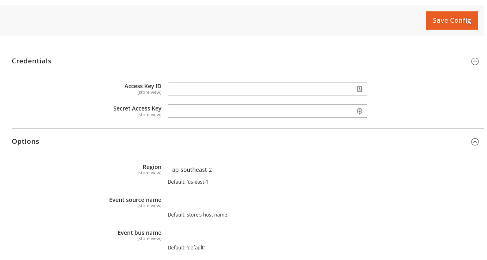

# Magento 2 Eventbridge Notifier

This repository adds an [aligent/async-events](https://github.com/aligent/magento-async-events) compatible notifier for submitting events to [Amazon EventBridge](https://aws.amazon.com/eventbridge/).

## Getting Started

### Configure AWS Credentials
An IAM role with the `events:PutEvents` action is required so that the notifier can relay events into Amazon EventBridge.

Under `Stores -> Services -> Amazon EventBridge` set the `Access Key ID` and the `Secret Access Key` and the `Region`. You
can configure the source of the event and the event bus if necessary.



### Create Subscription

```shell
curl --location --request POST 'https://m2.dev.aligent.consulting:44356/rest/V1/async_event' \
--header 'Authorization: Bearer TOKEN' \
--header 'Content-Type: application/json' \
--data-raw '{
    "asyncEvent": {
        "event_name": "example.event",
        "recipient_url": "Amazon Event Bridge ARN",
        "verification_token": "supersecret",
        "metadata": "event_bridge"
    }
}'
```
